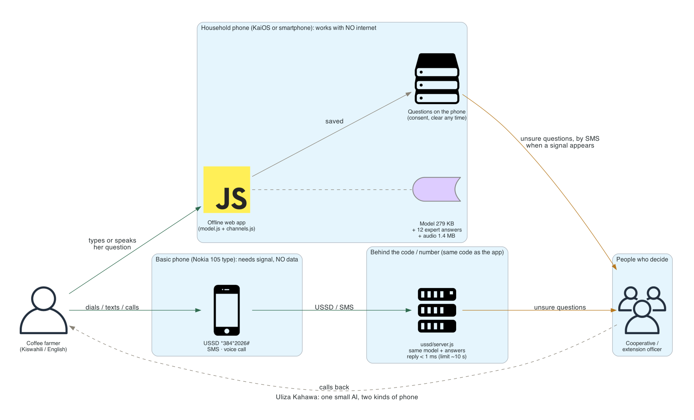
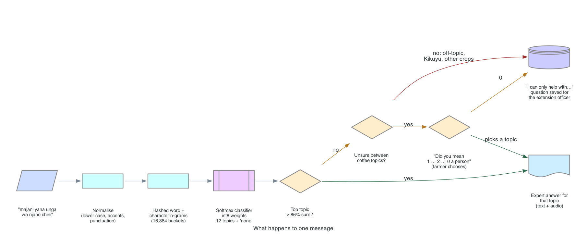

# Uliza Kahawa ("Ask about coffee")

**A tiny AI on the phone a farming household already has. It understands a coffee farmer's question in Kiswahili or
English, answers with advice written by coffee experts, works with no internet, and passes anything it isn't sure
about to a person.**

Hack-Nation 7th Global AI Hackathon · Challenge 4: World Bank, *Small AI for Development* · **Agriculture**
· Built Oct 3 to 4, 2026 · MIT License

**Live demo:** https://ofuwape.github.io/uliza-kahawa/ · runs entirely in the browser; switch your Wi-Fi off and it keeps working.
The demo stores nothing: questions live in your browser tab only and vanish when you close it, and "sent by SMS"
is simulated. The consent screen shows what a farmer would see in real use.

---

## The problem

Noor farms coffee on two hectares. Her yields have dropped and she can't say why. The extension officer reaches her
village twice a year at best, and at harvest she sells to whichever buyer drives up the valley, at whatever price he
names. Her own phone is a basic phone; the household's smartphone is home on weekends.

We set her in **Nyeri County, Kenya** (arabica coffee, farmer cooperatives) so every number has a place and a year:

- Kenya has about **1 public extension officer per 1,093 farm households**, against the 1:400 FAO recommends *(to verify against a primary source; see data/figures.md)*.
- Severe **coffee leaf rust can cut yields by more than 75%** (Gichuru et al., KALRO Coffee Research Institute, 2021).
- Only **35% of Kenyans use the internet** (World Bank WDI, 2024), and in rural areas mobile phone ownership was 36% vs 59% in towns (KNBS / UN Women, 2015/16 data).
- Farmers earned **KSh 101 to 120 per kg** in 2024 while the Nairobi auction hit a record **KSh 1,025 per kg** (Open African Tribune, Sep 2026, citing the Coffee Directorate).

> **Because of this tool, Noor will know what is hurting her coffee and what to do about it, and hold a reference
> price when the buyer names his, the same day she asks, instead of waiting months for the extension officer or
> guessing; we know because extension officers are this scarce and severe rust alone can take three quarters of a
> crop.**

## What it does: one decision, done well

Small AI means one well-defined problem. Ours is Noor's: **what is hurting my coffee, what do I do and when, and
what is my crop worth before I sell.**

1. **What's wrong?** Leaf rust, coffee berry disease, berry borer, or the "why did my harvest drop" checklist.
2. **What do I do, and when?** Spray timing with the rains, fertilizer and weeds, pruning, resistant varieties.
3. **Get more for the crop.** Picking ripe cherry, sorting for a better grade, and a dated reference price.

Anything else (other crops, livestock, general coffee facts, a pest we have no checked advice for) gets an honest
"I can only help with coffee problems, when to act and the price" and goes to the extension officer.

## Beyond answering: reaching farmers first (the connected tier)

The **Weekly brief** tab shows what the cooperative can push to every opted-in farmer, on any phone, by SMS: funding
she can apply for, where to meet other farmers, and coffee market news. It is drafted where there is internet (the
cooperative's office) with a grounded search that must cite the page each item came from (`data/briefing.py`;
items without a matching source are dropped), and **in real use an extension officer approves every item before it
is sent**. The search also returned two farmer events whose dates had already passed; the sample leaves them out,
which is exactly the kind of check the officer makes. The on-phone AI stays offline and fixed-answer; this tier is a
separate, human-approved channel.

## Try it in 60 seconds

1. Open the demo. Accept the first-use notice on the phone.
2. Click **"majani yana unga wa njano chini"** ("yellow powder under the leaves"): leaf rust, with when to spray.
3. Click **"tell me about rust berries"**: it isn't sure which problem you mean, so it asks **"Did you mean…"** instead of guessing.
4. Click **"bei ya maziwa"** ("milk price"): not coffee, so it says so and saves the question for a person.
5. Tick **No signal** (or turn your Wi-Fi off) and ask again: it still answers. Open **Questions for the extension officer** to see what is waiting to be sent.
6. Switch to **Basic phone**: press **Dial code**, type a question, and watch the reply time against the 10-second USSD limit (tick **Slow 2G**). Try **SMS** and **Voice call** too.
7. Open **Weekly brief**: sample SMS briefs (funding, the coffee market) as a basic phone would receive them, each with its source.
8. Switch **Phone language** between Kiswahili and English.

## How it works



**What happens to one message:**



- **The AI chooses; people write every word.** The model only picks one of 12 vetted answers. It cannot generate
  text, so it cannot invent a pesticide, a dose or a date.
- **Two phones, same AI.** On the household phone it runs as an offline web app (KaiOS phones run web apps; this
  page *is* the app). On a basic phone the same classifier and answers reach Noor by **USSD, SMS or a voice call**;
  that needs a phone signal but no internet or data. The basic-phone screen on the page runs the same code as the
  ready server in `ussd/server.js`.
- **Architecture, the data and build diagrams, and every trade-off we made:** [docs/ARCHITECTURE.md](docs/ARCHITECTURE.md).
- **The 10-second rule.** A USSD session drops if a reply takes more than about 10 seconds. Large cloud models can
  take seconds; this model answers in under a millisecond, so even on slow 2G the reply arrives with room to spare.

### Why AI, and not an SMS keyword menu?

Same unseen messages for both (`models/baseline.py`):

| Test | Right, directly or after one "did you mean" tap | Wrong answers |
|---|---|---|
| 258 clean messages | **Small model 91%** · keyword menu 74% | **2%** · 5% |
| Same messages with typos | **79%** · 41% | **0%** · 4% |
| 389 off-topic + Kikuyu sentences | n/a | **0** · 10 |

A keyword menu breaks on misspellings, Sheng and mixed languages, and when it is wrong it is confidently wrong. The
model reads the message as people actually type it, knows when it is unsure, and asks instead of guessing.

## The rules, checked

| World Bank rule | How we meet it |
|---|---|
| Runs on a device the user already has | A KaiOS-class phone or the household smartphone (offline app); Noor's own basic phone (USSD / SMS / voice) |
| Core feature works offline | Model, answers and audio are cached on the phone; questions for a person wait and send by SMS when a signal appears |
| Model small enough to side-load or send over a weak link | 279 KB model + 1.4 MB of audio; text-only install ≈ 300 KB |
| A local-language interaction | **Kiswahili** (text and voice). Tested in **Kikuyu**, a less-supported language: see below |
| A person makes the final call; avoid hallucinations | Fixed answers only, a confidence threshold, "did you mean", and a person for everything else |

## Evidence it works

| Check | Result |
|---|---|
| Held-out: trained on Gemini-written examples, tested on 258 hand-written ones it never saw | **97.7%** right when it answers; answers 68%, the rest go to "did you mean" or a person |
| Off-topic (unseen MASSIVE messages) | **100%** correctly not answered |
| **Kikuyu**, never trained on (72 machine-translated questions + 300 real FLORES-200 sentences) | Answers only 10% (all right); **0 false answers** on the 300 sentences: it fails safely to a person |
| Keyword menu comparison | See the table above |
| JavaScript model vs the Python training code | **303 / 303** identical predictions (`tests/parity.py`) |
| Basic-phone server (USSD + SMS over HTTP) | **19 / 19** checks, replies in 0.1 to 0.7 ms (`tests/ussd_test.js`) |

Details: [models/report.md](models/report.md), [models/baseline.md](models/baseline.md).

## Data

Every dataset with its source, license, size, date pulled and **what it does not cover**: [data/README.md](data/README.md).
Problem figures with their quotes: [data/figures.md](data/figures.md).

- **Advice:** KALRO Coffee Research Institute review of coffee leaf rust in Kenya (2021); reviews of coffee berry
  disease (2025) and the berry borer (2020); the FAO coffee plantation guide; Kenyan harvest and cooperative sources.
- **Language:** MASSIVE (Kiswahili + English utterances, for phrasing and off-topic examples), FLORES-200 (Kikuyu
  test), our own written examples.
- **Price and context:** World Bank commodity prices (Arabica, monthly), WFP food prices for Kenya, NASA POWER
  rainfall for Nyeri, FAOSTAT coffee yields, World Bank indicators.
- **Synthetic, and labelled as such:** 258 hand-written and 480 Gemini-generated training messages. There is no
  public dataset of real coffee-farmer messages in Kiswahili; that gap is the next point.

### The tool builds the dataset that doesn't exist

Every question the AI can't answer is saved, in the farmer's own words and language, for the extension officer.
That queue is exactly the dataset this problem lacks: real farmer questions in Kiswahili, Kikuyu and Sheng, labelled
by the officer who answers them. With the farmer's consent, it becomes the next model's training data, and the
officer's answers become new vetted entries in the list.

## Responsible AI, data and safety

- **Human oversight.** The tool informs; the farmer decides. It never acts for her. It answers only from a fixed,
  sourced list; below its confidence threshold it asks ("did you mean") or hands over to a person. Spray advice says
  "registered products at the label rate" and never gives a dose. The price is labelled "a reference, not an offer".
- **Where the data sits and who can read it.** Questions stay on the phone. Only questions sent to a person leave it,
  by SMS to the cooperative's extension officer, with her number so they can call back. Nothing goes to us or to any
  AI service: the model runs on the phone. The server stores no phone numbers (last two digits only, for the demo).
- **Consent.** A first-use notice explains this in her language. She can choose "don't send my questions"; then
  everything stays on the phone.
- **Lost or shared phone.** "Clear my questions" in the menu deletes everything on the phone. *Next:* an optional PIN.
- **Bias and limits, stated plainly.**
  - Training messages are synthetic; real messages will be messier. The "did you mean" and person routes are the safety net.
  - Kiswahili and English only in training; Kikuyu mostly gets "not sure". It is safe, but it is a gap: the farmers
    who most need a local language are served worst until real Kikuyu messages are collected.
  - The Kiswahili answer text is our draft and needs a native-speaker review before any real use.
  - The voice is synthetic (ElevenLabs) for the demo; in deployment an extension officer records each answer.
  - The reference price is the world Arabica price, not the farm-gate price in Nyeri.
  - Harvest and price advice comes from secondary sources (industry and news); disease advice from peer-reviewed and KALRO sources.
- **Build-time tools.** Gemini (grounded search) was used to find sources and to write synthetic training messages,
  and ElevenLabs to record the demo audio. Neither runs in the product.

## Reuse it somewhere else

The code knows nothing about coffee. A new crop, country or language needs:

1. a list of vetted answers with sources (`answers/answers.json`),
2. example messages per answer (`models/examples.py`), and
3. one retrain (`python3 models/train.py`, about 30 seconds on a laptop).

The phone app, offline cache, consent, queue and USSD / SMS / voice channels stay the same. Cocoa in Côte d'Ivoire,
maize in Malawi, or a clinic's appointment questions in Uganda are the same shape: one decision, a fixed list of
checked answers, a person behind it.

**What's next:** a native-speaker review of every answer; recordings by a local extension officer; a pilot with one
cooperative to collect real questions (with consent) and retrain on them, starting with Kikuyu; and letting the
cooperative add answers itself.

## Run it yourself

No dependencies beyond Python 3 and Node 18+.

```bash
python3 -m http.server 8000            # then open http://localhost:8000/app/
python3 data/fetch.py                  # pull the public datasets into data/raw/ (manual ones are listed)
python3 answers/build.py               # check the answer list, fill the live price -> answers.built.json
python3 models/train.py                # train + export models/model.json, write models/report.md
python3 models/kikuyu.py               # the Kikuyu test (translations cached in models/kikuyu_test.json)
python3 models/baseline.py             # keyword menu vs model
python3 tests/parity.py                # JS model == Python model
node tests/ussd_test.js                # basic-phone server checks
node ussd/server.js                    # the USSD / SMS server (POST /ussd, /sms) on :8790
```

Optional, build time only (needs your own keys): `data/research.py`, `models/augment.py` and `data/briefing.py` (Gemini),
`answers/voice.py` (ElevenLabs).

## What's in the repo

```
app/        the app as a web page: phone frames, model.js (classifier), channels.js (USSD / SMS logic), sw.js (offline)
models/     training, export, reports, Kikuyu test, keyword baseline, training examples
answers/    the fixed answer list, its checker / builder, recorded audio
ussd/       the basic-phone server (same code as the page)
data/       fetch script, data sheet, problem figures, advisory leads (raw files are fetched, not committed)
tests/      JS/Python parity, server checks
docs/       ARCHITECTURE.md (design + trade-offs) and diagrams/ (generated from make_diagrams.py)
```

Team: Oluwatoni Fuwape. Data sources keep their own licenses (listed in data/README.md); code is MIT.
