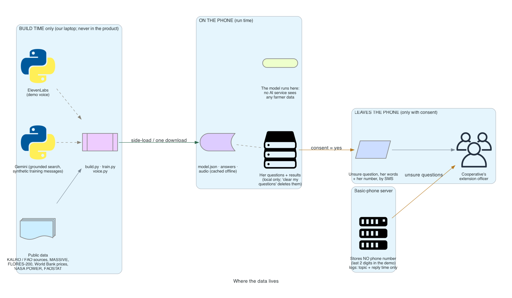
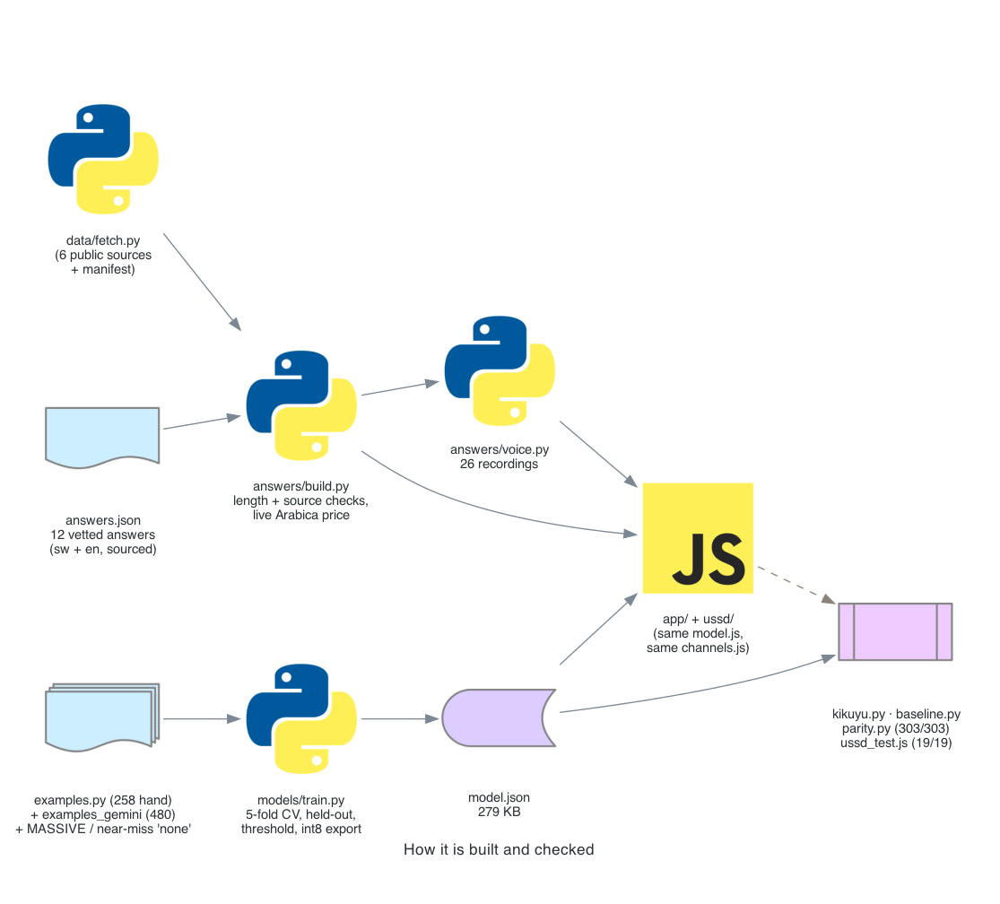

# Architecture and design decisions

How Uliza Kahawa is put together, why, and what we gave up to get there. Diagrams are generated from code:
`python3 docs/diagrams/make_diagrams.py` (needs `pip install diagrams` and Graphviz).

## 1. The system at a glance

Two paths to the same small AI and the same expert answers:

- **Household phone (the core, fully offline).** A web app (KaiOS phones run web apps; any phone browser works too)
  that carries the model, the answers and the audio. Nothing needs the network except sending a question to a person.
- **Basic phone (the add-on, signal but no data).** USSD, SMS and a voice line. The same classifier and channel logic
  run behind the code or number (`ussd/server.js`). The page simulates this phone with exactly that code.

Behind both sits a person: the cooperative's extension officer gets every question the AI won't answer.

**Connected tier (separate from the offline core):** a weekly SMS brief the cooperative sends to opted-in farmers
(funding, meeting other farmers, coffee market). `data/briefing.py` drafts it with a grounded search in two steps
(search notes, then items that must cite a URL the search actually returned); the officer approves each item on a
review screen; only approved items are sent. Generated text never reaches a farmer without a person's approval.

| Component | File | What it does |
|---|---|---|
| Classifier | `app/model.js` | Normalises text, hashes word + character n-grams, int8 softmax. ~80 lines, no dependencies. |
| Channel logic | `app/channels.js` | The decision rule (answer / did you mean / a person) and the USSD + SMS flows. Shared by page and server. |
| App | `app/index.html`, `app.js`, `app.css` | The phone screens, consent, log, queue, language switch, the basic-phone simulator. |
| Offline cache | `app/sw.js` | Saves the app, model, answers and audio on first load; network first when online, cache when not. |
| Answers | `answers/answers.json` → `answers.built.json` | 12 vetted answers + the fallback, Kiswahili + English, each with its source. |
| Audio | `answers/audio/` | 26 recordings, ~1.4 MB. |
| Server | `ussd/server.js` | POST /ussd and /sms for a real gateway; no phone numbers stored. |
| Training | `models/train.py` | Training, cross-validation, held-out test, threshold, int8 export. |

## 2. What happens to one message

1. **Normalise:** lower case, strip accents (so Kikuyu ĩ / ũ match i / u), punctuation to spaces.
2. **Features:** every word, every word pair, and the 2- to 4-letter pieces of each word, hashed into 16,384 buckets
   (FNV-1a). The character pieces are what make it robust to typos and Swahili word forms (`matundu`, `matunda`).
3. **Classify:** a softmax over 12 coffee topics plus "none" (not coffee).
4. **Decide** (`app/channels.js`):
   - top topic at **≥ 86%** confidence → its expert answer;
   - otherwise, if the top guess is a coffee topic (≥ 30%) → **"Did you mean"** with up to 3 real candidates
     (each ≥ 15% and at least a third of the top one) and **0 = talk to a person**;
   - otherwise → "I can only help with coffee problems, when to act and the price", saved for the extension officer.

Measured time: under 1 ms per message in the browser and on the server.

## 3. Where the data lives

- **Build time** (our laptop only): public datasets, Gemini (to find sources and write synthetic training messages),
  ElevenLabs (demo voice). None of this runs in the product.
- **On the phone:** the model, answers and audio; her questions and results. Deleted by "Clear my questions".
- **Leaves the phone, only with consent:** a question the AI won't answer, in her words, with her number, by SMS to
  the extension officer. If she chose "don't send my questions", nothing leaves.
- **Server:** stores no phone number (the demo keeps the last two digits so a queue entry can be told apart); logs the
  topic and the reply time only, never the message or the number.

## 4. How it is built and checked

`fetch.py` → `answers/build.py` (length and source checks, live price) → `voice.py`; `examples` → `train.py` →
`model.json`; then `kikuyu.py`, `baseline.py`, `tests/parity.py` (the JavaScript model gives the same predictions as
Python, 303 / 303) and `tests/ussd_test.js` (19 / 19).

## 5. Decisions and trade-offs

| Decision | What we chose | What we gave up | Why |
|---|---|---|---|
| **What the AI does** | Classify into a fixed list of answers written by people | Open conversation, general coffee knowledge | The brief: "If it can say anything, it cannot be checked for safety." A classifier cannot invent a pesticide, a dose or a date. |
| **Scope** | One decision: what's hurting the coffee, what to do and when, what the crop is worth | Breadth (planting, general facts, other crops) | "Single, well-defined problem." Out-of-scope questions go to a person on purpose, and become the data for the next version. |
| **Model type** | Hashed n-grams + softmax | Transformers / embeddings / a small LLM (Gemma-class, hundreds of MB) | Has to run in plain JavaScript on a $30 phone (KaiOS, 256 to 512 MB RAM) and download over a weak link. 279 KB, under 1 ms. Character n-grams handle typos and word forms that a word list misses. |
| **Weights** | int8 quantized, one scale | A little precision | 4x smaller than float32; the exported model matches the trained one on every test input. |
| **Confidence threshold** | 0.86 (lowest value keeping wrong answers ≤ 3% and off-topic answers ≤ 5% in cross-validation) | Coverage: it answers 68% of held-out questions directly | A confident wrong answer about someone's crop is worse than "ask a person". "Did you mean" wins most of the coverage back: the right answer is one tap away for 91% of held-out questions. |
| **"Did you mean"** | Offer real candidates only, plus "a person" | One more step for the farmer | She chooses; the tool never guesses. Also safe: every option is a vetted answer. |
| **Training data** | 258 hand-written + 480 Gemini-written messages, labelled synthetic; real off-topic utterances (MASSIVE); farm near misses | Real farmer messages (none exist publicly) | The held-out test uses messages from a different author than the training data, so the headline number is not the model grading its own homework. The queue collects the real data. |
| **Off-topic examples** | MASSIVE plus hand-written farm near misses (milk, tea, cows, antestia) | — | Without near misses the model answered "milk price" with the coffee price at 94%. |
| **Languages** | Kiswahili + English trained; Kikuyu tested, not trained | Kikuyu speakers get "not sure" most of the time | No usable Kikuyu farming data. We measured it instead of claiming it: 0 false answers on 300 real Kikuyu sentences, 10% answered. Honest gap, first target for real data. |
| **Voice** | Pre-recorded answers; keypad menu on the voice line | Speech input on the basic phone | A basic phone has no offline speech recognition, and a server ASR for Kiswahili / Kikuyu adds cost and errors. Fixed answers mean a person can record them, so no text-to-speech is needed in a language it handles badly. |
| **Demo voice** | ElevenLabs (synthetic), labelled | A human voice | Time. In deployment an extension officer records the same texts. |
| **App form** | A web app that is also the hosted demo | A native Android / KaiOS package | KaiOS apps are web apps, so this is the real thing, and judges can try it from a link. Packaging for a store is mechanical. |
| **Basic-phone channels** | Same code in the page and in a ready server | A live short code in the demo | Judges can't dial a Kenyan USSD code. Running the server's exact code in the page shows what a phone would get; real gateway integration is routine (we run it in production elsewhere). |
| **Offline cache** | Network first, cache fallback | Slightly slower first paint online | Cache-first kept serving stale code after updates. |
| **Sending to a person** | Store and forward by SMS, only with consent | Instant escalation | Works on 2G when a signal appears; the farmer controls it. |
| **Privacy** | No accounts, no phone numbers stored on the server, data stays on the phone | Analytics, usage tracking | The brief asks where data sits, who reads it, and what happens on a lost or shared phone. "Clear my questions" answers the last one; a PIN is next. |
| **Proactive briefs** | Grounded drafts + a person approves each item; opt-in SMS | Fully automatic sends | Generated content can be stale or wrong (the sample's two events had already happened). The approval step keeps "a person makes the final call", and the core stays fixed-answer. |
| **Price** | World Bank monthly Arabica price, dated, labelled "a reference, not an offer" | The farm-gate price in Nyeri | No open farm-gate series. We show the world price and Kenyan farmer-earnings figures, and say what it is not. |
| **Answer sources** | KALRO and peer-reviewed sources for disease; FAO for farm care; industry and news for harvest and price | Primary sources for every topic | Time; stated in the data sheet. The answer text says "ask your cooperative" wherever a source is thin. |

## 6. Limits, and what we would do next

- **Real messages.** Pilot with one cooperative: collect questions with consent, have the officer label them, retrain.
  Kikuyu first.
- **Native review.** Every Kiswahili answer checked by a speaker; recordings by a local officer.
- **Device test.** Run on a real KaiOS phone and an entry-level Android, measure load time and memory.
- **PIN** for shared phones.
- **Let the cooperative add answers** (a form that writes `answers.json` and retrains in seconds).
- **Reuse:** a new crop, country or language is three files (answers, examples, retrain); see the README.
